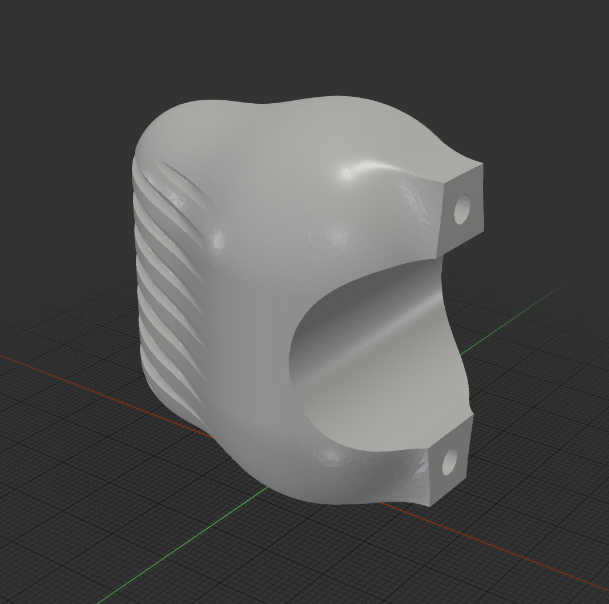
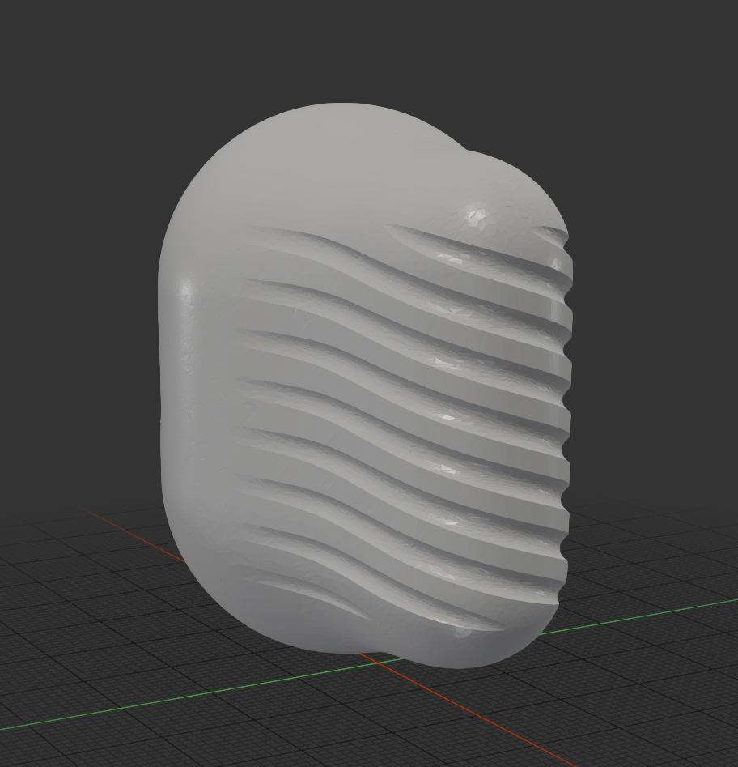

# sdf_to_mesh

Converts arbitrary Signed Distance Functions (SDFs) into STL meshes. SDFs are described in a small domain-specific language (`.sdf` files) and meshed using an adaptive octree marching cubes algorithm that concentrates samples near the surface, followed by a meshopt optimisation pass.





## How it works

1. **Parse** — the `.sdf` file is parsed into an AST and evaluated into a Rust closure `f(p: Vec3) -> f32`.
2. **Bound** — the bounding box of the SDF is estimated by iterative grid sampling.
3. **Mesh** — an adaptive BFS octree subdivides space, evaluating the SDF at each cell. Cells near the surface are refined down to `max_error` cell size; marching cubes extracts the isosurface from leaf cells.
4. **Optimise** — the raw triangle soup is deduplicated, simplified (meshopt), and vertex-cache optimised before writing to STL.

## Prerequisites

- A recent stable Rust toolchain (`rustup` is the easiest way to get one)
- See `Cargo.toml` for library dependencies — Cargo fetches them automatically

## Getting started

```sh
# Debug build — slow but fast to compile
cargo run

# Release build — strongly recommended, order-of-magnitude faster
cargo run --release
```

By default the program reads `example.sdf` from the working directory and writes `mesh.stl`. Open `mesh.stl` in any 3D viewer (e.g. MeshLab, Blender, PrusaSlicer).

To mesh a different file, change the path in `src/main.rs`:

```rust
let input = fs::read_to_string("my_model.sdf")?;
```

The `max_error` parameter controls the finest cell size (in model units). Halving it doubles resolution and roughly quadruples runtime.

---

## SDF DSL reference

Files are plain text with a `.sdf` extension. A program is a sequence of `let` bindings, optional `def` function definitions, and a final `return` statement that must evaluate to an `sdf`.

### Types

| Type | Description |
|------|-------------|
| `float` | 32-bit scalar |
| `vec2` | 2-component vector |
| `vec3` | 3-component vector |
| `vec4` | 4-component vector |
| `sdf` | Signed distance function |

### Literals and expressions

```
// Scalars
let x = 1.5;
let y = 3.0e-2;

// Vectors — angle-bracket syntax
let origin = <0, 0, 0>;
let up     = <0, 1, 0>;
let size   = <1.0, 2.0, 0.5>;

// Arithmetic: +  -  *  /  (scalar broadcasts to vector)
let v = <1, 2, 3> * 2.0;
let w = <4, 5, 6> - v;

// Unary negation
let neg = -up;

// Swizzle — components x/y/z/w or r/g/b/a or 0/1/2/3
let xz = v.xz;   // vec2
let z  = v.z;    // float
```

### Constants

`PI` / `pi` and `E` / `e` are predefined.

### Comments

```
// line comment
/* block comment */
```

### Functions

```
def my_shape(r: float, h: float) -> sdf {
    let body = cylinder(r, h);
    return body;
}
```

Parameters can be any type. The return type must match the `return` expression. Functions can call other user-defined functions and all built-ins.

---

### Built-in primitives

All primitives are centered at the origin unless noted. Use `translate` to place them.

| Call | Description |
|------|-------------|
| `sphere(radius)` | Sphere |
| `sphere(radius, center: vec3)` | Sphere at `center` |
| `box(size: vec3)` | Axis-aligned box with half-extents `size` |
| `box(size: float)` | Cube |
| `cuboid(...)` | Alias for `box` |
| `cylinder(radius, height)` | Cylinder along the Y axis |
| `capsule(radius, height)` | Capsule (cylinder with hemispherical caps) along Y |
| `torus(major_radius, minor_radius)` | Torus in the XZ plane |
| `plane(normal: vec3, offset: float)` | Infinite half-space. Points satisfying `dot(p, normal) + offset <= 0` are inside |

### Transforms

| Call | Description |
|------|-------------|
| `translate(sdf, offset: vec3)` | Move |
| `rotate(sdf, axis: vec3, angle: float)` | Rotate around `axis` by `angle` radians |
| `scale(sdf, factor: float)` | Uniform scale |
| `mirror(sdf, axis: 0\|1\|2)` | Reflect across the given axis (0=X, 1=Y, 2=Z) |
| `elongate(sdf, size: vec3)` | Stretch the interior of a shape along each axis |
| `twist(sdf, k: float)` | Twist around the Z axis; `k` is radians of twist per unit length |

### Boolean operations

| Call | Description |
|------|-------------|
| `union(a, b)` | Set union (minimum distance) |
| `intersection(a, b)` | Set intersection (maximum distance) |
| `difference(a, b)` | Subtract `b` from `a` |

### Smooth boolean operations

These blend the boundary between two shapes. `k` controls the radius of the blend — larger values produce a smoother transition.

| Call | Description |
|------|-------------|
| `smooth_union(a, b, k)` | Blended union |
| `smooth_intersection(a, b, k)` | Blended intersection |
| `smooth_difference(a, b, k)` | Blended difference |

### Domain operations

| Call | Description |
|------|-------------|
| `repeat(sdf, period: vec3, count: vec3)` | Tile `sdf` with the given period, clamped to `±count` repetitions per axis |
| `onion(sdf, thickness)` | Hollow the SDF into a shell of the given thickness |
| `offset(sdf, amount)` | Expand (positive) or shrink (negative) the surface |

### Math functions

| Call | Description |
|------|-------------|
| `abs(x)` | Absolute value (float or vector) |
| `sqrt(x)` | Square root |
| `pow(x, exp)` | Power |
| `exp(x)` | eˣ |
| `log(x)` | Natural logarithm |
| `sin(x)`, `cos(x)`, `tan(x)` | Trigonometric (radians) |
| `asin(x)`, `acos(x)`, `atan(x)` | Inverse trigonometric |
| `atan2(y, x)` | Four-quadrant arctangent |
| `floor(x)`, `ceil(x)`, `round(x)` | Rounding |
| `sign(x)` | Signum (−1, 0, or 1) |
| `min(a, b)`, `max(a, b)` | Component-wise min/max (float or vec3) |
| `clamp(x, lo, hi)` | Clamp float to range |
| `mix(a, b, t)` / `lerp(a, b, t)` | Linear interpolation |
| `length(v)` | Vector length |
| `normalize(v)` | Unit vector |
| `dot(a, b)` | Dot product |
| `cross(a, b)` | Cross product (vec3 only) |

---

### Example

```sdf
// A knurled handle

let radius = 1.0;
let knurl_depth = 0.1;
let knurl_twist = PI;

def knurled_cylinder(r: float, h: float, depth: float, twist_amt: float) -> sdf {
    let base = rotate(cylinder(r, h), <1, 0, 0>, PI / 2);
    let endcap_top = translate(sphere(r),  <0, 0,  h / 2.0>);
    let endcap_bot = translate(sphere(r), -<0, 0,  h / 2.0>);
    let endcaps = union(endcap_top, endcap_bot);
    let knurl = twist(box(<r - depth, r - depth, h / 2.0 + r>), twist_amt);
    return intersection(union(base, endcaps), knurl);
}

let center_shaft   = knurled_cylinder(radius, 3.0, knurl_depth, knurl_twist);
let grip_capsule   = translate(elongate(sphere(2.0), <0.0, 0.0, 1.0>), <2.5, 0.0, 0.0>);
let grip           = smooth_union(center_shaft, grip_capsule, 1.5);

return grip;
```

---

## ToDo

- [x] Basic SDF → mesh conversion
- [x] Basic SDF primitive & operator library
- [x] Optimising mesh passes (deduplication, simplification, vertex cache)
- [ ] Live preview using raymarching
- [ ] Clean up the implementation and API and publish as a crate
