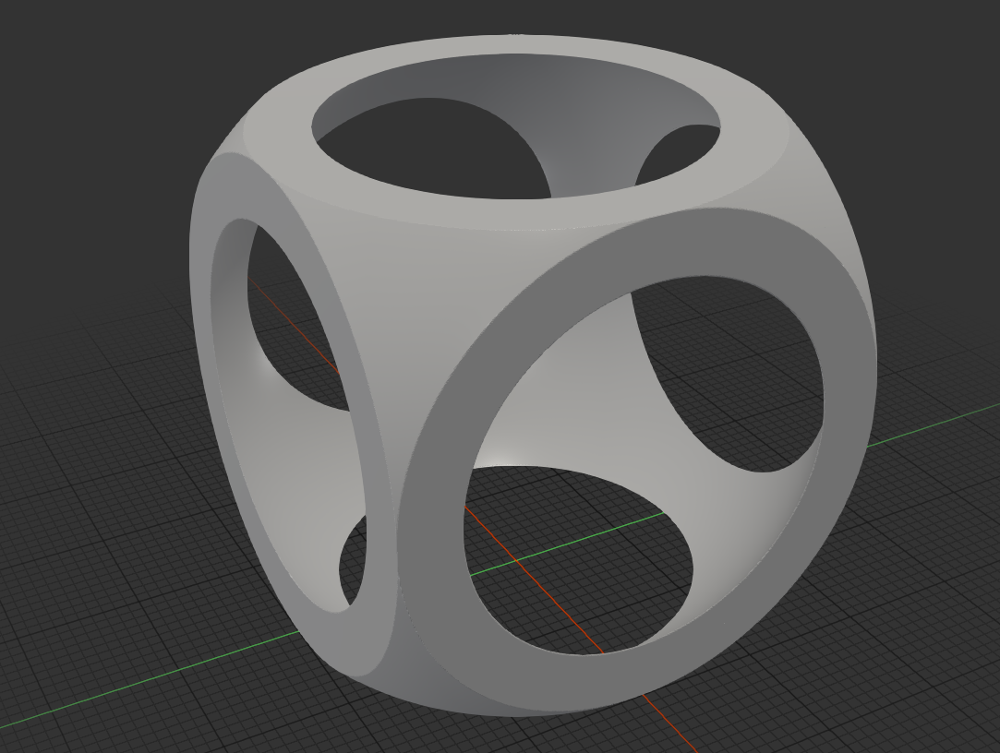
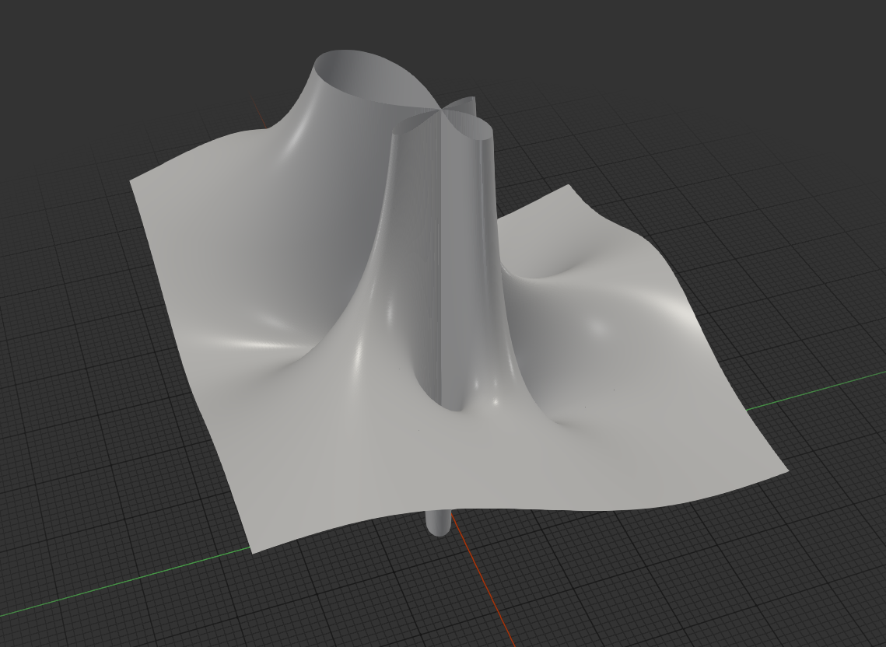

# Description

Modified Marching Cubes algorithm that converts arbitrary SDFs into STL meshes with arbitrary precision. It is (very) WIP and the algorithm does not merge adjacent faces that could (and should) be merged and is thus quite inefficient. Example outputs:

# Prerequisites

- Any sort of recent version of Rust & Cargo
- See Cargo.toml for dependencies

# Getting started

`cargo run`

builds and runs the current example, which is plotting a complex function. It is recommended to use the `--release` flag to better optimize the build since it significantly reduces runtime. You can define your own SDFs as you wish, the main.rs contains another example that shows how to use operators to combine SDFs.

# ToDo

- [x] Basic SDF -> Mesh conversion
- [ ] Basic SDF Primitive & Operator library
- [ ] Live preview output using raymarching
- [ ] Optimizing mesh passes (face merging etc)
- [ ] Clean up the implementation and API and create proper crate
